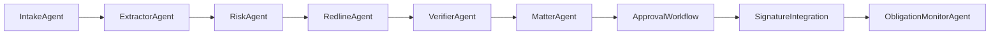

# Legal OS Architecture (Target State)

## Vision
Evolucionar LegalFlow de un analizador puntual a un sistema legal multiagente orientado a expedientes (matters), con trazabilidad completa de decisiones.

## Core modules
1. IntakeAgent
   - ingesta de contrato, anexos y contexto de negocio
2. ExtractorAgent
   - clausulas, obligaciones y evidencias
3. RiskAgent
   - scoring y riesgos contextualizados
4. RedlineAgent
   - propuestas de lenguaje contractual
5. VerifierAgent
   - QA legal y consistencia transversal
6. MatterAgent
   - expediente vivo, estados, aprobaciones, deadlines
7. ObligationMonitorAgent
   - seguimiento post-firma y alertas

## High-level flow

## API-first strategy
- API publica:
  - `POST /api/analizar`
  - `POST /api/casos`
  - `GET /api/casos`
  - `GET /api/casos/<id>`
- API futura:
  - `POST /api/matters`
  - `POST /api/matters/<id>/approve`
  - `POST /api/matters/<id>/sign`
  - `GET /api/matters/<id>/obligations`

## 3-phase roadmap
- Phase 1 (0-6 semanas)
  - robustecer orquestador, playbooks, trazabilidad UX
- Phase 2 (6-12 semanas)
  - matter lifecycle, aprobaciones y versionado documental
- Phase 3 (12+ semanas)
  - integraciones enterprise (DMS, CRM, e-signature, SSO)
